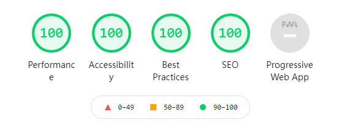

# Inkval 

> Generating Static Sites with Pandoc and Bash


## Features

* Only based on [Pandoc](https://pandoc.org/index.html) ang GNU core utilities
* Perfect score(100) on [Google lighthouse](https://github.com/GoogleChrome/lighthouse)
* Easy to use and expand functions
* Pagination support
* Tag slug support
* RSS support

For more information, visit [website](https://www.chunqiuyiyu.com/inkval/index.html)
and [docs](https://www.chunqiuyiyu.com/inkval/docs.html).

## Lighthouse Score



## Usage

```bash
curl -s https://raw.githubusercontent.com/chunqiuyiyu/inkval/main/inkval.sh | bash
# or
wget -qO - https://raw.githubusercontent.com/chunqiuyiyu/inkval/main/inkval.sh | bash
```

## License

MIT
